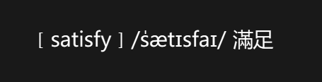
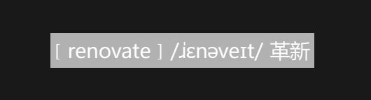

WordZ

This is a free software for learning new words and improving vocabulary.
Thanks for freedictionary project (https://freedict.org/) for the word database.

## Shortcuts

* CTRL + ALT + M : Move the window
* CTRL + ALT + N : Next word

## Contributing

Feel free to fork the repository and submit pull requests. Any contributions to improve the software are welcome!

## License

> This software is licensed under the GNU General Public License v3.0 with an additional restriction: Commercial use of this software or its derivatives is strictly prohibited without explicit permission from the copyright holder.